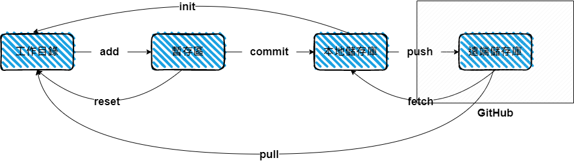

---

title: 常見 Git 指令整理

description: 常用的 Git 指令

summary: 整理一些常用的 Git 指令

published: '2022-10-03T15:11:00.000+08:00'

updated: '2022-10-03T15:11:00.000+08:00'

cover: ./cover.jpg

coverStyle: 'TOP'

tags:

- Git
- GitHub
---
# 開始使用 Git

在開始使用以前先簡單上個圖了解一下最單純的 Git 版本控制流程  
>中文名稱皆是我自己的翻譯，不代表正確名稱。若有誤歡迎提出指正，非常感謝。

## 作者設定

在開始使用 Git 前，需要先設定作者的個人資訊
這樣別人才知道哪個作者作出了改動 ( 一個專案可能會有很多作者 )
+ 設定本機全域作者名稱
`git config --global user.name “<firstname lastname>”`
+ 設定本機全域作者信箱
`git config --global user.email “<valid-email>”`

設定好姓名跟信箱以後就可以開始建立新專案囉

---

## 建立工作目錄

建立工作目錄的方式有兩種
1. 複製遠端儲存庫
`git clone <Git url>`
2. 初始化本地儲存庫
`git init <專案名稱>`

---

## 將修改後的檔案加入暫存區

+ `.` 是將修改過的檔案全部新增到暫存區的意思
`git add .`
+ 也可以只新增部分檔案。
`git add <檔案路徑>`
+ 當你發現放入暫存區的檔案有問題想退回工作目錄時
`git reset <檔案路徑>`
---

## 將暫存區的檔案加入本地儲存庫

將本次的修改內容加上註解，讓別人知道做了哪些修改
 `commit -m <註解內容>`
 >註解的基本原則是：開頭要以動詞作註解，英文的話首字要大寫
---

## 將本地儲存庫推送到遠端儲存庫

>第一次使用 GitHub 的話需要先設定 SSH 金鑰，可以參考 [這篇文章](https://ithelp.ithome.com.tw/articles/10205988)
1. 先新增一個遠端儲存庫位置
`git remote add <別稱> <Git url>`
2. 再來用新增好的遠端儲存庫位置推送出去
`git push <別稱> <分支名稱>`

---

## 拉取檔案

+ 將遠端儲存庫的更動拉到本地儲存庫並且合併到工作目錄
`git pull <別稱> <分支名稱>`
+ 將遠端儲存庫的更動拉到本地儲存庫但<strong>不合併</strong>到工作目錄
`git fetch <別稱> <分支名稱>`

---

## 結尾

今天列出來的都只是最基礎最簡單的指令，實際上在工作場合裡可能會遇到各種各樣的情境題。
未來有時間可以再把自己有遇到的狀況列出來給大家參考。
>你早晚都要學 Git 的，為何不現在開始就學呢？
## 參考資料

[設定 Github SSH 金鑰 feat. Github SSH、HTTPS 的差異 - iT 邦幫忙::一起幫忙解決難題，拯救 IT 人的一天 (ithome.com.tw)](https://ithelp.ithome.com.tw/articles/10205988) 
[連猴子都能懂的Git入門指南 | 貝格樂（Backlog）](https://backlog.com/git-tutorial/tw/) 
[Git 教學 - Git 書 - 為你自己學 Git | 高見龍 (gitbook.tw)](https://gitbook.tw/) 